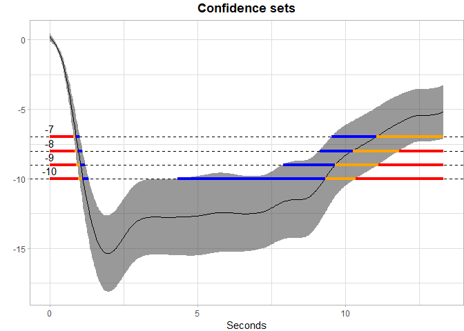

<!-- README.md is generated from README.Rmd. Please edit that file -->

# SCoRES

### What it does

------------------------------------------------------------------------

The identification of domain sets whose outcomes belong to predefined
subsets can address fundamental risk assessment challenges in
climatology and medicine. A motivating example involves estimating
geographical regions where average difference between summer and winter
temperatures exceed a certain benchmark, which help policymakers focus
on specific areas that are at higher risk for effects of climate change.

Therefore, a statistical framework is needed for estimating the set in
the domain of a function whose image equals a predefined subset, which
can be defined as $\mu^{-1}(U) = \{s \in S: \mu(s) \in U\}$, with *U* a
pre-specified subset of a real line ℝ (e.g., [*c*, ∞)). Proposed by
Sommerfeld et al. (2018), Coverage Probability Excursion (CoPE) sets,
defined as:
CS<sub>in</sub>(*U*) ⊆ *μ*<sup>−1</sup>(*U*) ⊆ CS<sub>out</sub>(*U*) are
used to assess the spatial uncertainty of the inverse set estimation

Ren et al. (2023) generalized the estimation to dense and non-dense
domains, and developed a fast and reliable construction method of
confidence sets for inverse sets over arbitrary chosen thresholds $c$
simultaneously. Based on Ren’s approach, this package provides useful
statistical tools for both the estimation of the inverse set and the
corresponding simultaneous outer and inner confidence sets (CSs).
Acceptable forms of input includes both 1D and 2D data for linear
regression, logistic regression, functional regression and spatial
generalized least square regression. More details can be found below.

### Installation

------------------------------------------------------------------------

To install from `CRAN`, please use:

``` r
# install.packages("SCoRES")
```

To install the latest version directly from Github, please use:

``` r
install.packages("devtools")
devtools::install_github("AngelaYuStat/SCoRES")
```

### How to use it

------------------------------------------------------------------------

The example here is to use ccds functional data to construct the inverse
confidence sets (CS) from simultaneous confidence bands (SCB) using
Function-on-Scalar Regression (FoSR).

The ccds dataset contains repeated measures of percent change over time
for multiple subjects under two user categories (use: 1 and no use: 0).
It includes both user and non-user groups, time points, and metadata
related to eye side and frame timing. cleaning process make sure that
the data only includes measurements taken from the right eye at the
post-intervention time point (`tp == "post"`).

``` r
library(SCoRES)
data(ccds)
```

Before calculating the SCBs, we first process ccds data by fitting a
mean GAM model, extracting residuals and performing FPCA using
`SCoRES::prepare_ccds_fpca()`, the function will return an enhanced
dataset includes the FPCA-derived basis scores (Phi1, Phi2, Phi3, Phi4)
for Function-on-Scalar Regression (FoSR) analysis.

Following the FPCA-based data augmentation, we fit a FoSR model using
`mgcv::bam()`, which allows efficient estimation of Generalized Additive
Mixed Models (GAMMs). The model formula is designed to capture both
population-level smooth trends and subject-specific functional
variation.

The function-on-scalar regression model is

$Y_i(t) = \beta_0(t) + \beta_1(t) X_{i1} + b_i(t) + \epsilon_i(t),$

``` r
ccds_fpca <- SCoRES::prepare_ccds_fpca(ccds)
fosr_mod <- mgcv::bam(percent_change ~ s(seconds, k=30, bs="cr") +
            s(seconds, by = use, k=30, bs = "cr") +
            s(subject, by = Phi1, bs="re") +
            s(subject, by = Phi2, bs="re") +
            s(subject, by = Phi3, bs="re") +
            s(subject, by = Phi4, bs="re"),
            method = "fREML", data = ccds_fpca, discrete = TRUE)
```

After obtaining the FoSR object `fosr_mod`, simultaneous confidence
bands (SCB) can be constructed though `SCoRES::SCB_functional_outcome`
using pre-specified methods. The `SCoRES` package provides two options
for calculating the simultaneous confidence bands (SCB). Use `method` to
specify. Use `groups` to specify the names of grouping variables to
analyze. The input data should have numerical binary 0/1 values for all
scalar group variables. Here, we analyze the user group by specifying
`groups = "use"`. Use `fitted` to specify the object for SCB estimation.
If `fitted = TRUE`, `SCoRES::SCB_functional_outcome` will construct the
SCB for the fitted mean outcome function. If `fitted = FALSE`,
`SCoRES::SCB_functional_outcome` will construct the SCB for the fitted
parameter function. Use `est_mean` to specify the point estimate for
constructing SCB. If `est_mean = TRUE`, `SCoRES::SCB_functional_outcome`
will estimate the simultaneous confidence bands for fitted mean outcome
function. If `est_mean = FALSE`, `SCoRES::SCB_functional_outcome` will
estimate the simultaneous confidence bands for sample mean.

Here, we estimated SCBs using both options seperately for the mean
outcome Y(t) of user's group:
$\hat{f}(t) = E[Y(t) | X_{1} = 1]= \beta_0(t) + \beta_1(t),$ where:

-   $Y_i(t)$ is a functional outcome (percent_change)
-   $X_{i1}$ is a scalar covariate (use)

``` r
# CMA approach
results_ccds_cma <- SCoRES::SCB_functional_outcome(data = ccds,
                                          object = fosr_mod, 
                                          method = "cma",
                                          fitted = TRUE,
                                          est_mean = TRUE, 
                                          alpha = 0.05, 
                                          outcome = "percent_change", 
                                          time = "seconds", 
                                          group_name = "use", 
                                          group_value = 1, 
                                          subject = "subject")
```

The code below visualizes the **inverse confidence sets (CSs)** derived
from SCB results using the `SCoRES::plot_cs()` function. The `results`
object is first converted to a tibble for easier manipulation.

The `levels = c(-7, -8, -9, -10)` argument specifies a set of
thresholds, and `SCoRES::plot_cs()` function estimates multiple inverse
upper excursion sets corresponding to these thresholds, and plot the
estimated inverse set, the inner confidence set, and the outer
confidence set.

``` r
results_ccds_cma <- tibble::as_tibble(results_ccds_cma)
plot_cs(results_ccds_cma,
        levels = c(-7, -8, -9, -10), 
        x = results_ccds_cma$time, 
        mu_hat = results_ccds_cma$yhat, 
        xlab = "Seconds", 
        ylab = "Percent_Outcome", 
        level_label = T, 
        min.size = 40, 
        palette = "Spectral", 
        color_level_label = "black")
```

<!-- -->

The plot demonstrate how to use SCB to find regions of s where the
estimated mean is greater than or equal to the four levels -7, -8, -9,
-10 for ccds data. The gray shaded area is the 95% SCB, the solid black
line is the estimated mean. The red horizontal line shows the inner
confidence sets (where the lower SCB is greater than the corresponding
level) that are contained in the estimated inverse set represented by
the union of the yellow and red horizontal line (where the estimated
mean is greater than the corresponding levels); the outer confidence
sets are the union of the blue, yellow and red line (where the upper SCB
is greater than the corresponding levels) and contain both the estimated
inverse sets and the inner confidence sets.
