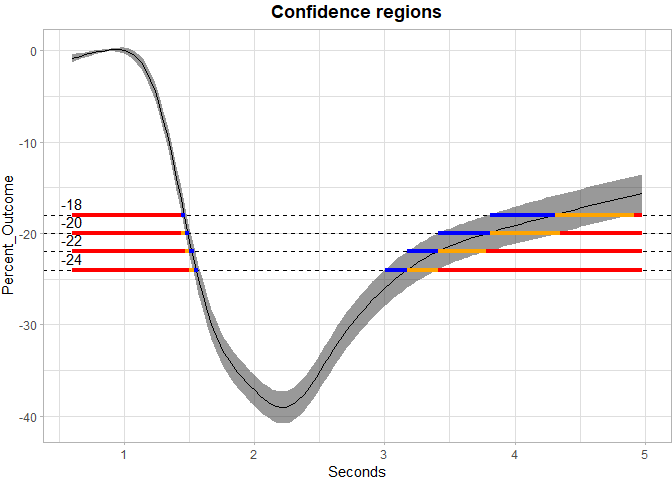

<!-- README.md is generated from README.Rmd. Please edit that file -->

# invSCI

### What it does

------------------------------------------------------------------------

The identification of domain sets whose outcomes belong to predefined
subsets can address fundamental risk assessment challenges in
climatology and medicine. A motivating example involves estimating
geographical regions where average difference between summer and winter
temperatures exceed a certain benchmark, which help policymakers focus
on specific areas that are at higher risk for effects of climate change.

Mathematically, the target region correspond to the inverse image of
*U* ⊂ ℝ
under an unknown function
*μ* : 𝒮 → ℝ
, can be defined as
*μ*<sup>−1</sup>(*U*) = {*s* ∈ *S* : *μ*(*s*) ∈ *U*}
, with
*U*
a pre-specified subset of a real line
ℝ
(e.g.,
\[*c*, ∞)
).

A point estimator for the inverse set can be constructed as
*μ̂*<sub>*n*</sub><sup>−1</sup>(*U*)
, where
*μ̂*<sub>*n*</sub>
is an empirical estimator of
*μ*
based on
*n*
observations. To quantify the spatial uncertainty of this estimation,
Sommerfeld et al. (2018) introduced Coverage Probability Excursion
(CoPE) sets, defined as:
CS<sub>in</sub>(*U*) ⊆ *μ*<sup>−1</sup>(*U*) ⊆ CS<sub>out</sub>(*U*)
which satisfy:
ℙ(CS<sub>in</sub>(*U*) ⊆ *μ*<sup>−1</sup>(*U*) ⊆ CS<sub>out</sub>(*U*)) ≥ 1 − *α*
for a pre-specified confidence level
1 − *α*
(e.g.,
*α* = 0.05
).

Existing approaches require restrictive assumptions, including domain
density of
*S*
in
*R*
, continuity of
*μ̂*<sub>*n*</sub>
and *μ* near thresholds, and large-sample guarantees, which limit the
applicability. Besides, the estimation and coverage depend on setting a
fixed threshold level, which is difficult to determine.

Ren et al. (2023) proposed a framework that generalizes the estimation
of such inverse sets to dense and non-dense domains with protection
against inflated Type I error, and constructs multiple upper, lower or
interval confidence sets of
*μ*<sup>−1</sup>(*U*)
over arbitrary chosen thresholds. The coverage probability is achieved
non-asymptotically and simultaneously through inverting simultaneous
confidence intervals. For instance, suppose we are interested in inverse
set
*μ*<sup>−1</sup>(\[*c*, ∞))
for a single value
*c*
, the inverse confidence sets (CSs) are constructed by inverting
simultaneous confidence intervals (SCIs). Given SCI bounds
*B̂*<sub>*l*</sub>(**s**)
and
*B̂*<sub>*u*</sub>(**s**)
satisfying:

ℙ(∀**s** ∈ 𝒮 : *B̂*<sub>*l*</sub>(**s**) ≤ *μ*(**s**) ≤ *B̂*<sub>*u*</sub>(**s**)) = 1 − *α*

The inner and outer CSs for the inverse upper excursion set
*μ*<sup>−1</sup>\[*c*, ∞)
are defined as:  
CS<sub>in</sub>\[*c*, ∞) := *B̂*<sub>ℓ</sub><sup>−1</sup>\[*c*, ∞)

CS<sub>out</sub>\[*c*, ∞) := *B̂*<sub>*u*</sub><sup>−1</sup>\[*c*, ∞)

The outer and inner confidence sets (CSs) for the inverse lower
excursion set
*μ*<sup>−1</sup>(−∞, *c*\]
are defined as:

CS<sub>in</sub>(−∞, *c*\] := *B̂*<sub>*u*</sub><sup>−1</sup>(−∞, *c*\] = (*B̂*<sub>*u*</sub><sup>−1</sup>\[*c*, +∞))<sup>∁</sup>

CS<sub>out</sub>(−∞, *c*\] := *B̂*<sub>ℓ</sub><sup>−1</sup>(−∞, *c*\] = (*B̂*<sub>ℓ</sub><sup>−1</sup>\[*c*, +∞))<sup>∁</sup>

The inner and outer CSs for the inverse interval set
*μ*<sup>−1</sup>\[*a*, *b*\]
are defined as:

CS<sub>in</sub>\[*a*, *b*\] := *B̂*<sub>ℓ</sub><sup>−1</sup>\[*a*, ∞) ∩ *B̂*<sub>*u*</sub><sup>−1</sup>(−∞, *b*\]

CS<sub>out</sub>\[*a*, *b*\] := *B̂*<sub>*u*</sub><sup>−1</sup>\[*a*, ∞) ∩ *B̂*<sub>ℓ</sub><sup>−1</sup>(−∞, *b*\]

This package provides useful statistical tools for both the estimation
of the inverse set and the corresponding simultaneous outer and inner
confidence sets (CSs). Acceptable forms of input includes both 1D and 2D
data for linear regression, logistic regression, and functional
regression. More details can be found below.

### Installation

------------------------------------------------------------------------

To install from `CRAN`, please use:

``` r
# install.packages("invSCI")
```

To install the latest version directly from Github, please use:

``` r
install.packages("devtools")
devtools::install_github("AngelaYuStat/invSCI")
```

### How to use it

------------------------------------------------------------------------

The first example here is to use ccds functional data to construct the
inverse confidence sets (CS) from simultaneous confidence bands (SCB)
using Function-on-Scalar Regression (FoSR).

The ccds dataset contains repeated measures of percent change over time
for multiple subjects under two user categories (use: 1 and no use: 0).
It includes both user and non-user groups, time points, and metadata
related to eye side and frame timing. cleaning process make sure that
the data only includes measurements taken from the right eye at the
post-intervention timepoint (`tp == "post"`).

``` r
library(invSCI)
data(ccds)
```

Before calculating the SCBs, we first process ccds data by fitting a
mean GAM model, extracting residuals and performing FPCA using
`invSCI::prepare_ccds_fpca()`, the function will return an enhanced
dataset includes the FPCA-derived basis scores (Phi1, Phi2, Phi3, Phi4)
for Function-on-Scalar Regression (FoSR) analysis.

Following the FPCA-based data augmentation, we fit a FoSR model using
`mgcv::bam()`, which allows efficient estimation of Generalized Additive
Mixed Models (GAMMs). The model formula is designed to capture both
population-level smooth trends and subject-specific functional
variation.

``` r
ccds_fpca <- invSCI::prepare_ccds_fpca(ccds)
fosr_mod <- mgcv::bam(percent_change ~ s(seconds, k=30, bs="cr") +
            s(seconds, by = use, k=30, bs = "cr") +
            s(subject, by = Phi1, bs="re") +
            s(subject, by = Phi2, bs="re") +
            s(subject, by = Phi3, bs="re") +
            s(subject, by = Phi4, bs="re"),
            method = "fREML", data = ccds_fpca, discrete = TRUE)
```

After obtaining the FoSR object `fosr_mod`, simultaneous confidence
bands (SCB) can be constructed though `invSCI::SCB_functional_outcome`
using pre-specified methods. The `invSCI` package provides two options
for calculating the simultaneous confidence bands (SCB). Use `method` to
specify. Use `groups` to specify the names of grouping variables to
analyze. The input data should have numerical binary 0/1 values for all
scalar group variables. Here, we analyze the user group by specifying
`groups = "use"`. Use `fitted` to specify the object for SCB estimation.
If `fitted = TRUE`, `invSCI::SCB_functional_outcome` will construct the
SCB for the fitted mean outcome function. If `fitted = FALSE`,
`invSCI::SCB_functional_outcome` will construct the SCB for the fitted
parameter function. Use `est_mean` to specify the point estimate for
constructing SCB. If `est_mean = TRUE`, `invSCI::SCB_functional_outcome`
will estimate the simultaneous confidence bands for fitted mean outcome
function. If `est_mean = FALSE`, `invSCI::SCB_functional_outcome` will
estimate the simultaneous confidence bands for sample mean.

``` r
# CMA approach
results_ccds_cma <- invSCI::SCB_functional_outcome(data = ccds,
                                          object = fosr_mod, 
                                          method = "cma",
                                          fitted = TRUE,
                                          est_mean = TRUE, 
                                          alpha = 0.05, 
                                          outcome = "percent_change", 
                                          time = "seconds", 
                                          group_name = "use", 
                                          group_value = 1, 
                                          subject = "subject")

#CMA approach for parameter function
results_ccds_cma_para <- invSCI::SCB_functional_outcome(data = ccds,
                                          object = fosr_mod, 
                                          method = "cma",
                                          fitted = FALSE,
                                          est_mean = TRUE, 
                                          alpha = 0.05, 
                                          outcome = "percent_change", 
                                          time = "seconds", 
                                          group_name = "use", 
                                          group_value = 1, 
                                          subject = "subject")

# Multiplier-t Bootstrap
results_ccds_wild <- invSCI::SCB_functional_outcome(data = ccds, 
                                          object = fosr_mod, 
                                          method = "wild",
                                          fitted = TRUE,
                                          est_mean = TRUE, 
                                          alpha = 0.05, 
                                          outcome = "percent_change", 
                                          time = "seconds", 
                                          group_name = "use", 
                                          group_value = 1, 
                                          subject = "subject")

# Multiplier-t Bootstrap (use sample mean)
results_ccds_wild_sample <- invSCI::SCB_functional_outcome(data = ccds, 
                                          object = fosr_mod, 
                                          method = "wild",
                                          fitted = TRUE,
                                          est_mean = FALSE, 
                                          alpha = 0.05, 
                                          outcome = "percent_change", 
                                          time = "seconds", 
                                          group_name = "use", 
                                          group_value = 1, 
                                          subject = "subject")
```

The mathematical details can be found in README.pdf:

`invSCI` provides two options for estimating the mean function at
*s*
, denoted as
*μ̂*<sub>*N*</sub>(*s*)
. If `est_mean = TRUE`, the mean function will be estimated though using
the fitted regression object. If `est_mean = FALSE`, sample mean will be
calculated. Default is `FALSE`.

1.  The **sample mean**

2.  The **fitted mean value** from a functional regression model (e.g.,
    using `mgcv::bam`).

In the wild bootstrap procedure, `invSCI` supports three types of
multiplier distributions, which is specified by `weights`:

-   `"rademacher"`:
    *g*<sub>*i*</sub> ∈ {−1, +1}
    with equal probability
-   `"gaussian"`:
    *g*<sub>*i*</sub> ∼ 𝒩(0, 1)
-   `"mammen"`: A two-point distribution with mean zero and variance one
    (see Mammen, 1993)

Default is `rademacher`.

Two options are available for estimating the standard error
*ϵ̂*<sub>*N*</sub><sup>\*</sup>(*s*<sub>*j*</sub>)
, which is specified by `method_SD`:

-   “regular” (empirical standard error based on residuals).
    
-   “t” (bootstrap second moment-based estimator).

Default is `t`.

The code below visualizes the **inverse confidence sets (CSs)** derived
from SCB results using the `invSCI::plot_cs()` function. The `results`
object is first converted to a tibble for easier manipulation.

The `levels = c(-7, -8, -9, -10)` argument specifies a set of
thresholds, and `invSCI::plot_cs()` function estimates multiple inverse
upper excursion sets corresponding to these thresholds, and plot the
estimated inverse set, the inner confidence set, and the outer
confidence set.

``` r
results_ccds_cma <- tibble::as_tibble(results_ccds_cma)
plot_cs(results_ccds_cma,
        levels = c(-7, -8, -9, -10), 
        x = results_ccds_cma$time, 
        mu_hat = results_ccds_cma$yhat, 
        xlab = "Seconds", 
        ylab = "Percent_Outcome", 
        level_label = T, 
        min.size = 40, 
        palette = "Spectral", 
        color_level_label = "black")
```

<!-- -->

The plot demonstrate how to use SCB to find regions of s where the
estimated mean is greater than or equal to the four levels -7, -8, -9,
-10 for ccds data. The gray shaded area is the 95% SCB, the solid black
line is the estimated mean. The red horizontal line shows the inner
confidence sets (where the lower SCB is greater than the corresponding
level) that are contained in the estimated inverse set represented by
the union of the yellow and red horizontal line (where the estimated
mean is greater than the corresponding levels); the outer confidence
sets are the union of the blue, yellow and red line (where the upper SCB
is greater than the corresponding levels) and contain both the estimated
inverse sets and the inner confidence sets.

The next plot shows the SCB for the coefficient funtion for the use
group.

``` r
results_ccds_cma_para <- tibble::as_tibble(results_ccds_cma_para)
plot_cs(results_ccds_cma_para,
        levels = c( c(1.5, 2, 2.5, 3)), 
        x = results_ccds_cma_para$time, 
        mu_hat = results_ccds_cma_para$yhat, 
        xlab = "Seconds", 
        ylab = "Percent_Outcome", 
        level_label = T, 
        min.size = 40, 
        palette = "Spectral", 
        color_level_label = "black")
```

<!-- -->

The following plots show the results of wild bootstrap. The only
difference between these two plots is that, the solid black line in the
first one represents the estimated mean fitted through functional
regresson object, while the second represents the sample mean. All
possible NA’s are imputed using `refund::fpca.face()`.

``` r
results_ccds_wild <- tibble::as_tibble(results_ccds_wild)
plot_cs(results_ccds_wild,
        levels = c(-7, -8, -9, -10), 
        x = results_ccds_wild$time, 
        mu_hat = results_ccds_wild$yhat, 
        xlab = "Seconds", 
        ylab = "Percent_Outcome",
        level_label = T, 
        min.size = 40, 
        palette = "Spectral", 
        color_level_label = "black")
```

<!-- -->

``` r
results_ccds_wild_sample <- tibble::as_tibble(results_ccds_wild_sample)
plot_cs(results_ccds_wild_sample,
        levels = c(-7, -8, -9, -10), 
        x = results_ccds_wild_sample$time, 
        mu_hat = results_ccds_wild_sample$yhat, 
        xlab = "Seconds", 
        ylab = "Percent_Outcome", 
        level_label = T, 
        min.size = 40, 
        palette = "Spectral", 
        color_level_label = "black")
```

<!-- -->

To further illustrate the power of `invSCI::SCB_functional_outcome` for
constructing SCBs for multiple group variables, we load the pupil data
and perform the analysis introduced before.

``` r
data(pupil)
library(dplyr)
# filter all NA subjects
pupil <- pupil %>% 
  filter(!(id %in% c("003-1068", "003-112")))
pupil_fpca <- invSCI::prepare_pupil_fpca(pupil)
fosr_mod <- mgcv::bam(percent_change ~ s(seconds, k=30, bs="cr") +
            s(seconds, by = use, k=30, bs = "cr") +
            s(seconds, by = smoker, k=30, bs = "cr") +
            s(seconds, by = daily, k=30, bs = "cr") +
            s(seconds, by = gender, k=30, bs = "cr") +
            s(id, by = Phi1, bs="re") +
            s(id, by = Phi2, bs="re") +
            s(id, by = Phi3, bs="re") +
            s(id, by = Phi4, bs="re"),
            method = "fREML", data = pupil_fpca, discrete = TRUE)
```

Here, we analyze the daily male user group by specifying
`group_name = c("use", "daily", "gender")` and
`group_value = c(1, 1, 0)`. We set `fitted = TRUE` and `est_mean= TRUE`.

``` r
# CMA approach
results_pupil_cma <- invSCI::SCB_functional_outcome(data = pupil,
                                          object = fosr_mod, 
                                          method = "cma", 
                                          fitted = TRUE,
                                          est_mean = TRUE, 
                                          alpha = 0.05, 
                                          outcome = "percent_change", 
                                          time = "seconds", 
                                          group_name = c("use", "daily", "gender"), 
                                          group_value = c(1, 1, 0), 
                                          subject = "id")

# Multiplier-t Bootstrap
results_pupil_wild <- invSCI::SCB_functional_outcome(data = pupil, 
                                          object = fosr_mod,
                                          fitted = TRUE,
                                          method = "wild", 
                                          est_mean = TRUE, 
                                          alpha = 0.05, 
                                          outcome = "percent_change", 
                                          time = "seconds", 
                                          group_name = c("use", "daily", "gender"), 
                                          group_value = c(1, 1, 0), 
                                          subject = "id")
```

The following plots show the SCBs and inverse SCBs for the mean outcome
function. The first one is from CMA approach and the second is from wild
bootstrap.

``` r
results_pupil_cma <- tibble::as_tibble(results_pupil_cma)
plot_cs(results_pupil_cma,
        levels = c(-18, -20, -22, -24), 
        x = results_pupil_cma$time, 
        mu_hat = results_pupil_cma$yhat, 
        xlab = "Seconds", 
        ylab = "Percent_Outcome",
        level_label = T, 
        min.size = 40, 
        palette = "Spectral", 
        color_level_label = "black")
```

<!-- -->

``` r
results_pupil_wild <- tibble::as_tibble(results_pupil_wild)
plot_cs(results_pupil_wild,
        levels = c(-18, -20, -22, -24), 
        x = results_pupil_wild$time, 
        mu_hat = results_pupil_wild$yhat, 
        xlab = "Seconds", 
        ylab = "Percent_Outcome",
        level_label = T, 
        min.size = 40, 
        palette = "Spectral", 
        color_level_label = "black")
```

## <!-- -->

The second example here is to use simulated data to construct the
inverse confidence sets (CS) from simultaneous confidence bands (SCB)
using linear regression.

`invSCI::SCB_linear_outcome()` function use a non-parametric bootstrap
algorithm to construct the SCB in linear regression. The argument
`df_fit` specifies a data frame containing the training design matrix
used to fit the linear model, while `grid_df` contains the test set
design matrix for constructing SCB. Use argument `model` to specify the
formula used for fitting the linear model.

``` r
library(invSCI)
set.seed(262)
# generate simulated data
x1 <- rnorm(100)
x2 <- rnorm(100)
epsilon <- rnorm(100,0,sqrt(2))
y <- -1 + x1 + 0.5 * x1^2 - 1.1 * x1^3 - 0.5 * x2 + 0.8 * x2^2 - 1.1 * x2^3 + epsilon
df <- data.frame(x1 = x1, x2 = x2, y = y)
grid <- data.frame(x1 = seq(-1, 1, length.out = 100), x2 = seq(-1, 1, length.out = 100))
# fit the linear regression model and obtain the SCB for y
model <- "y ~ x1 + I(x1^2) + I(x1^3) + x2 + I(x2^2) + I(x2^3)"
results <- SCB_linear_outcome(df_fit = df, model = model, grid_df = grid)
```

Likewise, the `levels = c(-0.3, 0, 0.3)` argument specifies a set of
thresholds, and `invSCI::plot_cs()` function estimates multiple inverse
upper excursion sets corresponding to these thresholds, and plot the
estimated inverse set, the inner confidence set, and the outer
confidence set.

``` r
results <- tibble::as_tibble(results)
plot_cs(results,
        levels = c(-0.3, 0, 0.3), 
        x = seq(-1, 1, length.out = 100), 
        mu_hat = results$Mean, 
        xlab = "", 
        ylab = "", 
        level_label = T, 
        min.size = 40, 
        palette = "Spectral", 
        color_level_label = "black")
```

<!-- -->

In addition to linear regression, `invSCI` also
provides`invSCI::SCB_logistic_outcome()` for estimating the SCB for
outcome of logistic regression, and `invSCI::SCB_regression_coef`can
estimate the SCB for every coefficient in the linear/logistic model. For
details, please refer to the corresponding package vignette.

### 📄 Documentation

------------------------------------------------------------------------

👉 [Full mathematical appendix (PDF)](invSCI.pdf)

> This document contains all the LaTeX-rendered formulas, definitions of CS, SCBs, and bootstrap methods.
